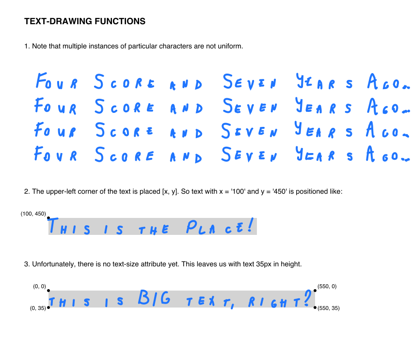

# SVG Whiteboard Illustration Helper

Nothing fancy here. Just a few functions for generating SVG elements that appear to be *drawn by hand* in marker, including lines, curves, arrows, circles, polygons, dots, and text (in my own handwriting). The colors and other styling are meant to imitate the look of drawing on a whiteboard. Right now the functions are very similar to those in [svg-napkin](https://github.com/TripleDataArts/svg-napkin), but I expect them to diverge a bit as they're developed.

## Quick Start
Download [`whiteboard.js`](https://github.com/TripleDataArts/svg-whiteboard/edit/master/whiteboard.js) and reference it in an HTML file:

```html
<html>
  <head>
    <script type="text/javascript" src="whiteboard.js"></script>
  </head>
  <body>
    1) Open your browser's console and try out some whiteboard.js functions
    2) Copy and paste the output into your text editor and you've got an SVG!
  </body>
</html>
```
### Wrapper Functions
There are two functions for generating either a SVG or HTML wrapper for whatever SVG elements you make with the **Element Functions**.

`whiteboard.svg_wrapper(width = 1000, height = 700, color = "Blue", title = "A Whiteboard SVG Illustration")`

`whiteboard.html_wrapper(width = 1000, height = 700, color = "Blue", title = "A Whiteboard SVG Illustration")`

`width` and `height` are the dimensions (in pixels) of the SVG image. The default dimensions are 1,000px by 700px.

The `color` options are `"Black", "Blue", "Red"`.

The `title` parameter is used in the SVG (and HTML)`<title>` element. It is not, however, drawn on the image. For that, you must use the `draw_text` function described below.

### Element Functions

**LINES**

`whiteboard.draw_line(startX, startY, endX, endY)`

**CURVES**

`whiteboard.draw_curve(coordinates)`

`coordinates` is an array of arrays where the inner arrays are `[x, y]`.

A smooth-ish curve will be drawn through the points as a series of cubic Bezier curves. Calculation of the Bezier control points comes from [Lubo Brieda](https://www.particleincell.com/).

**ARROWS**

`whiteboard.draw_arrow(startX, startY, endX, endY)`

The pointy end goes at `endX, endY`.

**POLYGONS**

`whiteboard.draw_polygon(coordinates)`

`coordinates` is an array of arrays where the inner arrays are `[x, y]`. For example, you could make a square with:

`whiteboard.draw_polygon([0, 0], [100, 0], [100, 100], [0, 100])`

**DOTS**

`whiteboard.draw_dot(x, y)`

`x` and `y` are the coordinates of the center of the dot, which is between 1.1 and 1.8 pixels in radius.

**CIRCLES**

`whiteboard.draw_circle(cx, cy, r, whiteout = false)`

`cx` and `cy` are the coordinates of the center of the circle and `r` is the radius. `whiteout` fills a circle and a small margin around it with the background color.

**TEXT**

`whiteboard.draw_text(x, y, text)`


Format: 

`x` and `y` indicate the position of the text, which is left-aligned. Unlike regular SVG text, `y` is aligned with the top of the text. There is presently no text-size attribute; `draw-text()` makes only big text (35 pixels in height). Larger or smaller text can be achieved by placing the `<path class='text'...>` element in a `<g>` element with a `transform='scale()'` value. 

So far, the characters that can be used in `draw_text()` aren't quite a whole keyboard's worth. The supported characters are:

- ABCDEFGHIJKLMNOPQRSTUVWXZ
- abcdefghijklmnopqrstuvwxyz
- 1234567890
- ',-&.:"()+$?!/

## TODOs

- Add text-size attribute
- Add text-align attribute
- Add missing text character
- Improve handling of spacing between characters
